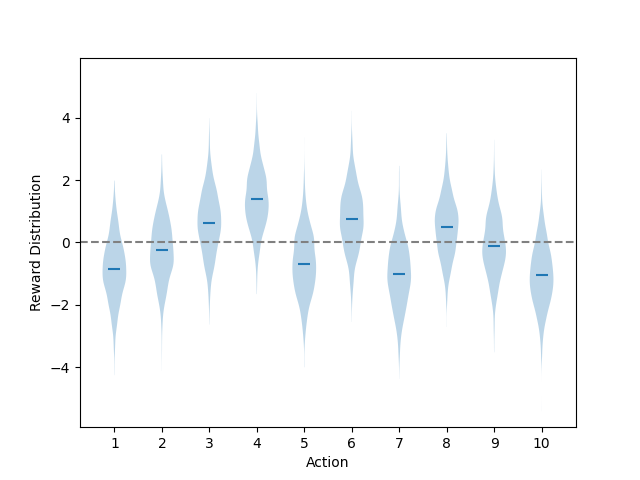
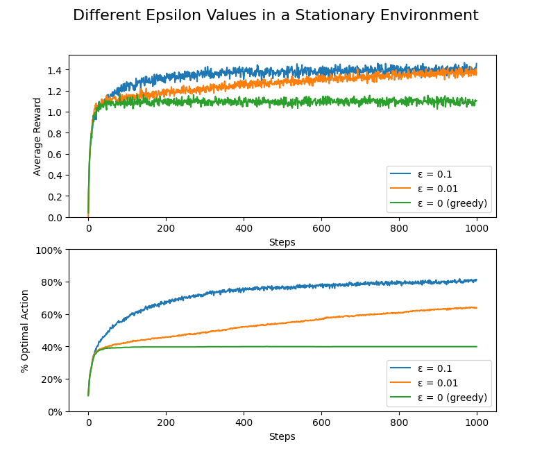
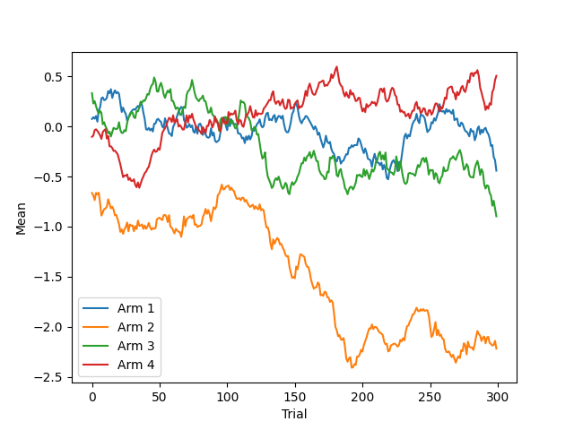
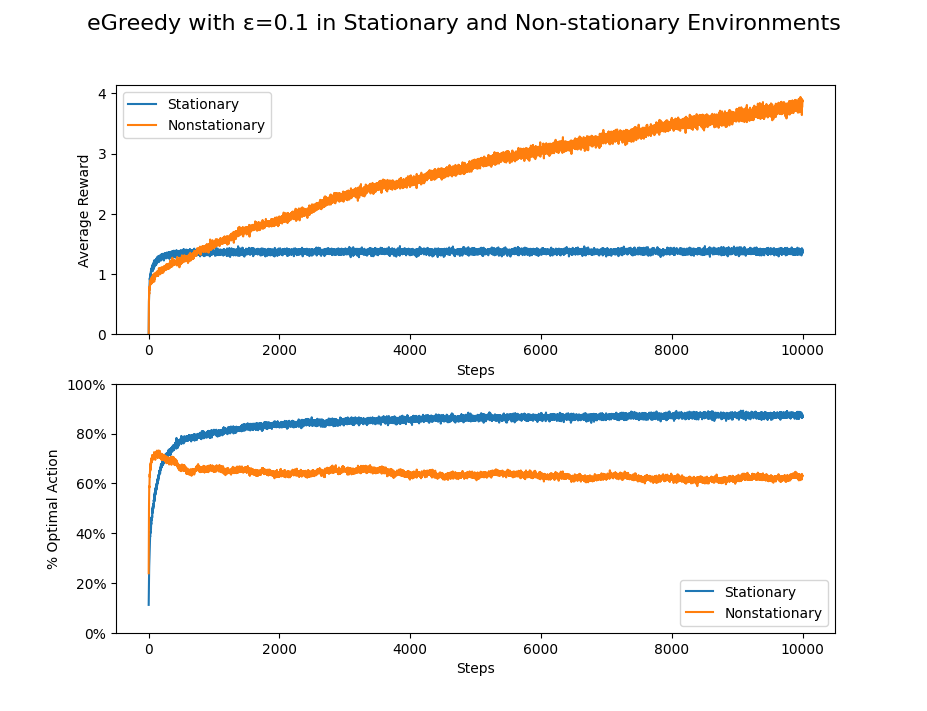
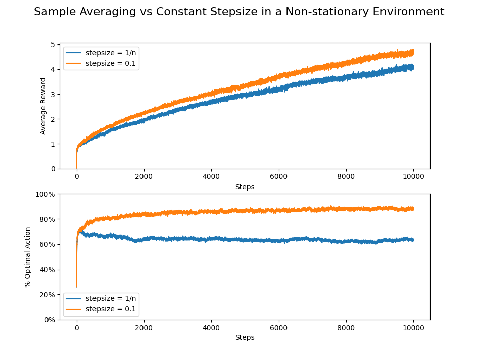

# Multi-Arm Bandits

Playing around with some RL models in Python!! :) 
Following along chapter 2 of [Sutton & Barto (2018)](http://incompleteideas.net/book/RLbook2020.pdf).

## Figures
Example 10-arm testbed sampled from a normal distribution with mean zero and unit variance

Comparison between different epsilon values for the 10-arm testbed (stationary environment). 
A pure greedy method (ε=0) does not perform very well.

Now we try a non-stationary environment. Example problem depicting 4 random walk arms.

In the non-stationary environment, egreedy (ε=0.1) using sample averages does not perform as well as in stationary
environments. Using a constant stepsize parameter (α=0.1) is more suitable for non-stationary
environments.

## Other Links
- [https://github.com/ShangtongZhang/reinforcement-learning-an-introduction](https://github.com/ShangtongZhang/reinforcement-learning-an-introduction)
- [https://github.com/jettdlee/10_armed_bandit](https://github.com/jettdlee/10_armed_bandit)
- [https://github.com/dquail/NonStationaryBandit](https://github.com/dquail/NonStationaryBandit)