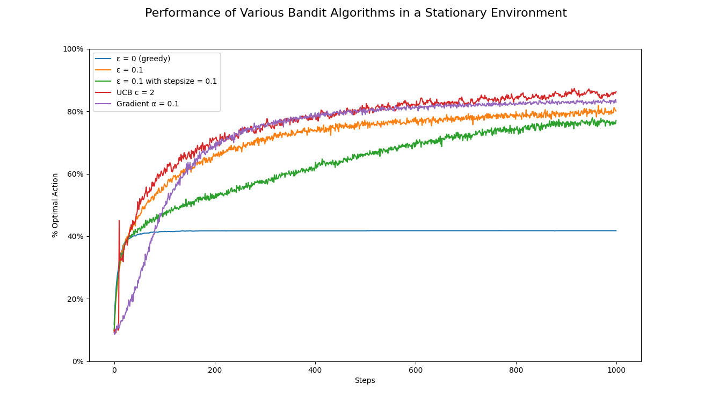
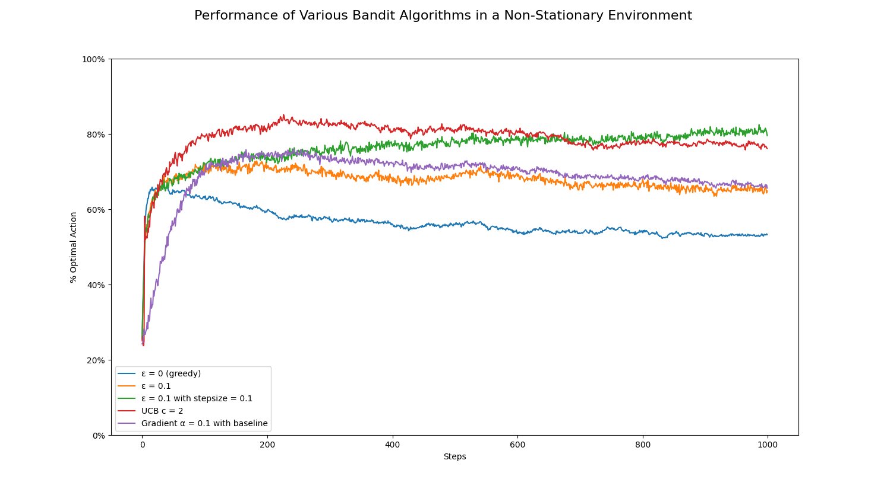

# Multi-Arm Bandits

Playing around with some RL models in Python!! :)

## Figures
Example stationary 10-arm testbed sampled from a normal distribution with mean zero and unit variance.

Comparison between different epsilon values for the 10-arm testbed (stationary environment). 
A pure greedy method (ε=0) does not perform very well.

Now we try a non-stationary environment. Example problem depicting 4 random walk arms.

In the non-stationary environment, egreedy (ε=0.1) using sample averages does not perform as well as in stationary
environments. Using a constant stepsize parameter (α=0.1) is more suitable for non-stationary environments.
Note that we change the environment to have 4 arms (rather than 10), which was mistakenly missed for the stationary
environment—for 4 arms the average reward would rise to around 1.0 instead of 1.5.

Look into: why does the average reward for non-stationary environments increase over time?
Adding an extra line to the function where we update the arms to ensure that the rewards do not increase too much
results in a more stable average reward over time.
Plotting the non-stationary walk over time tends to results in at least one arm increasing (compared to if it remained
stationary). When the agent greedily chooses the arm with the highest average reward, it makes sense that the average
reward would increase over time... even though the egreedy method is not the best method for non-stationary environments.

We also try different models such as UCB and Gradient.

## Resources
- Chapter 2 of [Sutton & Barto (2018)](http://incompleteideas.net/book/RLbook2020.pdf)
- [https://github.com/ShangtongZhang/reinforcement-learning-an-introduction](https://github.com/ShangtongZhang/reinforcement-learning-an-introduction)
- [https://github.com/jettdlee/10_armed_bandit](https://github.com/jettdlee/10_armed_bandit)
- [https://github.com/dquail/NonStationaryBandit](https://github.com/dquail/NonStationaryBandit)
- [https://github.com/ondrejbiza/bandits](https://github.com/ondrejbiza/bandits)